```{r setup, include=FALSE}
knitr::opts_chunk$set(echo = TRUE)
```

In class, we have talked about creating RStudio Projects and using the {rio}
and {here} packages to load data. There are arguably easier ways to load data. 
In these notes, I'll outline the process we've been using step-by-step and make
the case for why I think it's preferable to other methods. My hope is to
convince you that it's worth the additional effort, and to clarify common 
points of confusion to help avoid errors in the future. However, I'll conclude
with an alternative (easier) import method, which I'll allow for the rest of 
the term, but I'll also discuss the weaknesses of that method.

# The workflow
## Projects
Each time we are working on a new project - however it is you define that - we
should create a new RStudio Project. Projects can be as big (all my materials
for this course are associated with a single project), or small (a single lab)
as you want. 

### The rules
> 1. **All** files necessary for a project are in the project folder (e.g.,
data, scripts, etc.)
2. Each RStudio Project is separate (no projects within projects)

For class, I very common workflow may be to start a new project for that week.
Create "data" and "scripts" folders within that folder. Place all the data you
will need for that week in the data folder (all of which should be in the
corresponding module on Canvas), and save your notes and lab scripts in the
"scripts" folder.

### Creating a project
First, click on the project logo at the upper-right of your screen.

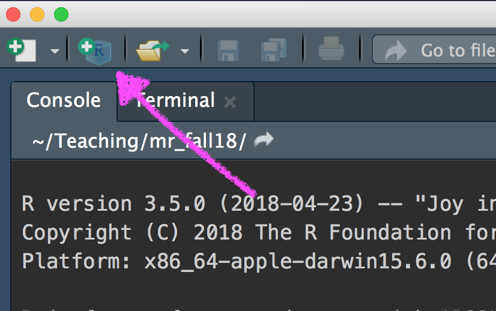

Next, tell it you want to create the project folder in a new directory.

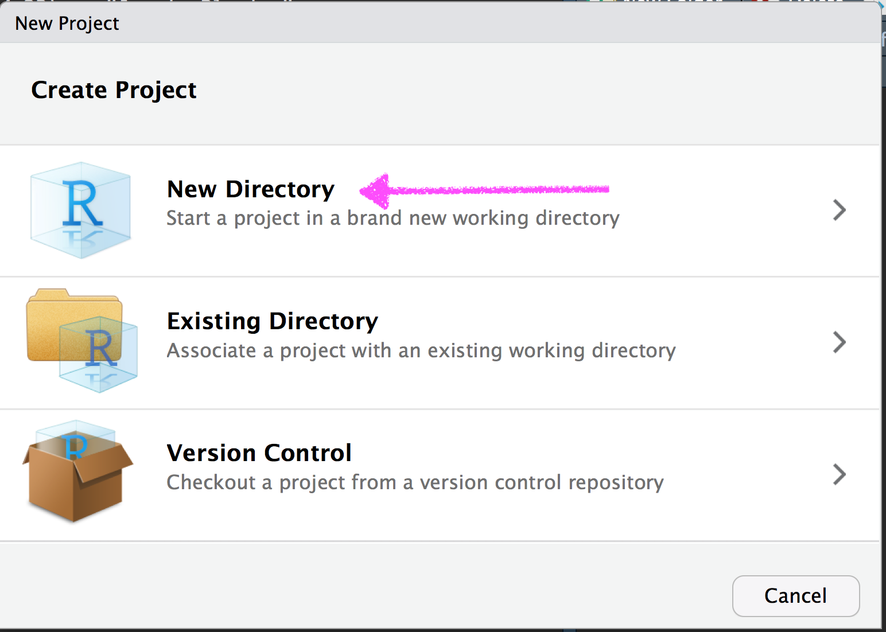

Confirm you want to create a new project.

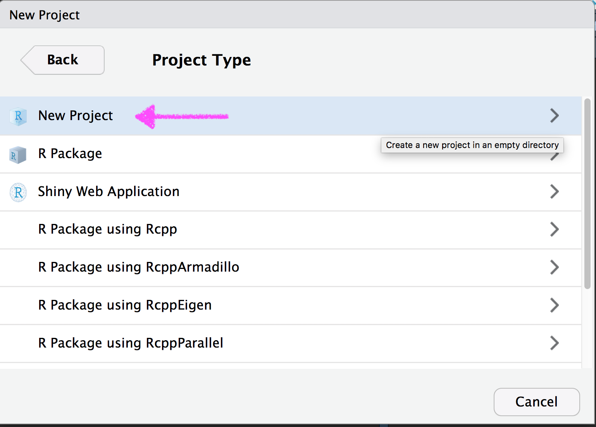

Finally, give your project a name, navigate to where you want it to save on 
your computer, and create the project.

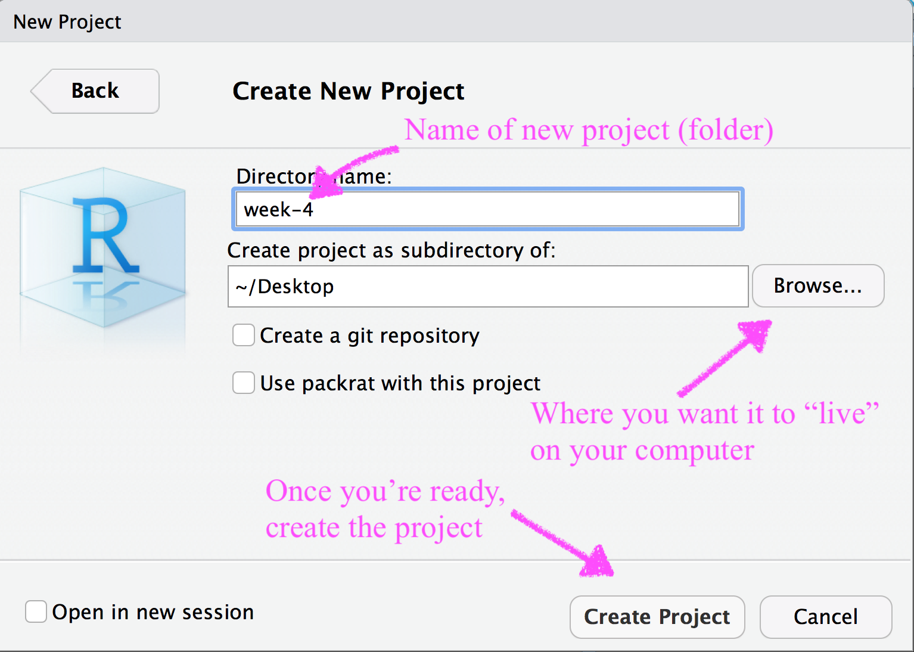

Once you create the new project, RStudio will re-launch.

### Setting up your project

Once RStudio has re-launched, you should be in your project. The first thing to
notice is that your file path has changed. The file path is displayed near the
console, which by default is in the lower left. This path should show,
basically, the folder structure to your RStudio project.

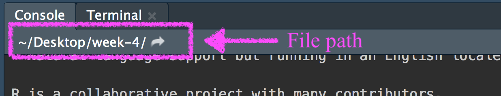

This is now where R will "look" for any files/folders.

Next, we'll go outside of RStudio and navigate through your folders to find the
project.


Once you find the project folder, we will create empty folders inside it for
your data and scripts. You can actually do this from within RStudio as well, 
but we'll need to put some things in these folders eventually so this is
probably easier.

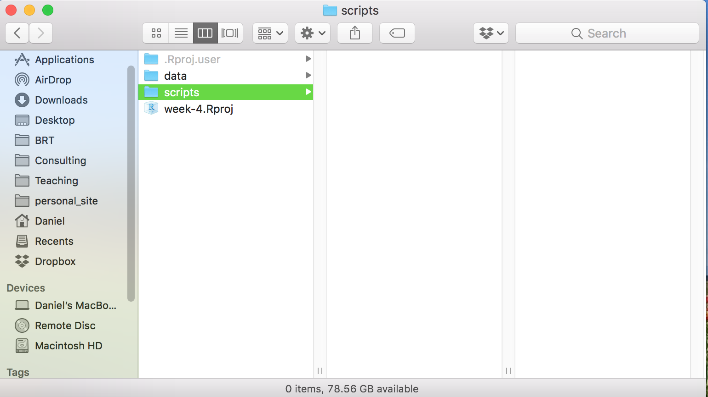

Now, we're all set to add data to our project. In this case I've added the
*elemapi.sav* file, along with *hsb2.sav* and *coding-lab.sav*. Note that you
often may only have one dataset for a project, but as I'm illustrating here, 
you can just as easily add many datasets.

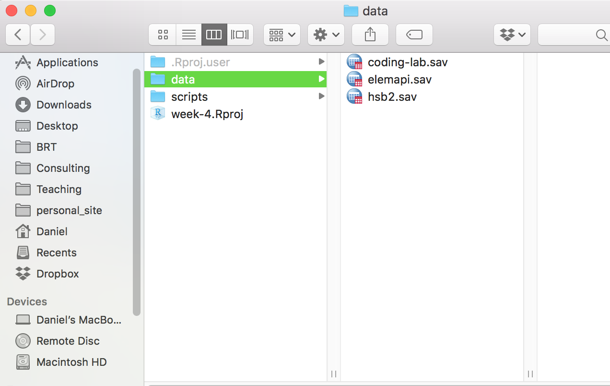


Finally, we're going to add some scripts. Usually, classes will include scripts
that we will run through and a lab. You can put these files in the script
folder. You may also want to add notes from class, if you have them in an R
script. 

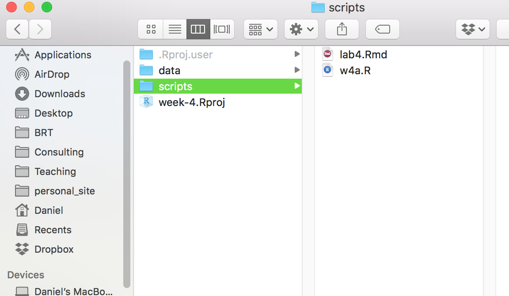

At this point, our project is entirely setup, and we're ready to go.


## {here}
One of the things that many people find confusing about R at first is how to
navigate file paths. Every computer has its own unique folder structure, and
code can easily break between individuals if the code is relying on a specific
file structure. The {here} package helps. 

### Rule
> Launch projects, not scripts

If RStudio is not yet open and you launch a script, RStudio will place your
working directory to wherever that script lives. This can be problematic
because, if your script is in the "scripts" folder, as we've outlined above,
that will become your working directory and there will not be a "data" folder
inside it. However, if you're using the {here} library, this concern is
mitigated because {here} will **always** see the root folder for the project as
the place to "start" its search for files. So `here("data", "elemapi.sav")` 
will find the *elemapi* dataset, even if your working directory is set to
somewhere else within the project. This will fail, however, if you have an
RStudio Project within another project.

## {rio}
Now your project should be setup, you should be able to find data using {here}
regardless of where your working directory is set (as long as it's within a
project), and we're ready to load some data. The {rio} library is
straightforward because it provides a single function, `import` that does all
the work. The below should read each of the different data into our R session,
storing each in a different object, which we can then use for analysis,
exploration, and visualization. This assumes you have launched the project 
first (by double clicking on the .Rproj icon on your computer).

```{r load-data1, eval = FALSE}
library(here)
library(rio)
coding <- import(here("data", "coding-lab.sav"))
api <- import(here("data", "elemapi.sav"))
hsb <- import(here("data", "hsb2.sav"))
```

I have also been recommending you import the data as tibbles, which basically
just have nicer printing functions. If you wanted to do that, the above code
would change to

```{r load-data2, eval = FALSE}
library(here)
library(rio)
coding <- import(here("data", "coding-lab.sav"),
                 setclass = "tbl_df")
api <- import(here("data", "elemapi.sav"),
              setclass = "tbl_df")
hsb <- import(here("data", "hsb2.sav"),
              setclass = "tbl_df")
```

Note that this code will work regardless of the file type. So if you're
importing an excel file, or a csv file, the code should still "just work".

If you're importing an SPSS file, it is generally best to use the
`characterize` function from rio. This will import any labels associated with
numeric values. Because all of the files above are SPSS files, we could apply 
it to each of them, and the code would become

```{r load-data3, eval = FALSE}
library(here)
library(rio)
library(tidyvese)

coding <- import(here("data", "coding-lab.sav"),
                 setclass = "tbl_df") %>%
	characterize()

api <- import(here("data", "elemapi.sav"),
              setclass = "tbl_df") %>%
	characterize()

hsb <- import(here("data", "hsb2.sav"),
              setclass = "tbl_df") %>%
	characterize()
```

Note that I've loaded the tidyverse in this chunk as well, which allows me to
use the pipe (`%>%`). See the intro to the tidyverse notes for more info on the
pipe.

Finally, it is worth noting that the `characterize()` function will **only**
work if you are importing an SPSS, SAS, or Stata file. It will not work for
CSVs, Excel, or any other file type. 

# Making the case for this workflow
The above may seem overly complicated and in some ways it is. What it buys you,
however, is a high likelihood of reproducibility. This means that you can share
the entire project with a colleague and they should be able to run your scripts
and everything should just work. This is a big deal. Open science is becoming
increasingly prominent and will only become more-so in the coming years. Some
funders are even starting to require open science practices. This hasn't
impacted educational research too much yet, but it is absolutely coming. If you
publish a paper and others cannot use your data and get the same results you
did, that is highly problematic. But, it's actually very common. There are
*many* decisions that go into an analysis. It's important that they are
documented with sufficient clarity that an independent researcher could
reproduce the results *exactly*. If they can't even load your data, it's going
to be tough to reproduce your results. This workflow will ensure they at least
get that far.

# An alternative
An alternative that is *much* easier, but loses all of the benefits of the 
above is to use RStudio's built-in data importer. 

1. Use the Files pane to navigate to the file you want to import. 
2. Click on the file, and select "Import Dataset"

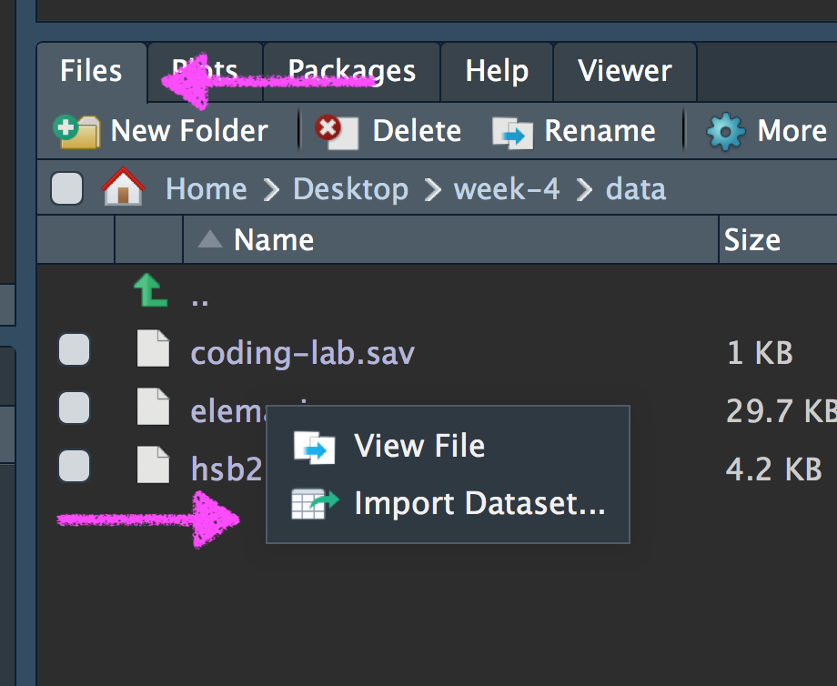


This will take you to a data-import helper. 

3. Click the clipboard to copy the code, then cancel, so you don't actually
import the data.

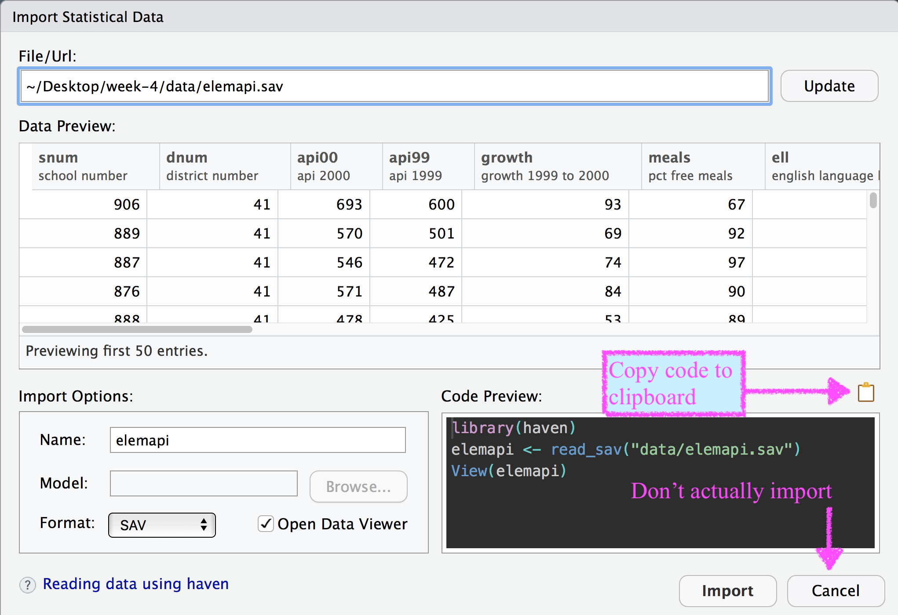

4. Copy and paste the code into your R script or R Markdown file.

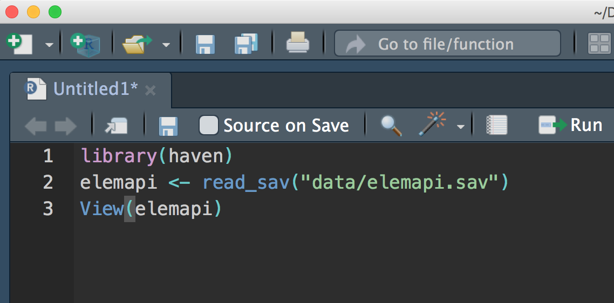


If you have done the work above, so you are in an R Studio project, it will
actually give you a relative path from the project root directory, which is
almost as good. You could actually even replace the path it gives you with the 
{here} code and then you're golden. 

## Reasons to avoid this approach
The primary reason to avoid this approach is the same reason we want to use
RStudio Projects. If you are in a project and you find this approach easier, go
for it. It's not quite as robust as using {here}, but it's still pretty good.

However, if you're not in an RStudio Project, it will give you the full path to
the folder. 

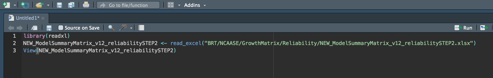

If *any* change in the folder structure changes between the last time you 
opened the script and your current session, the code will break and it will not
read in the data. Additionally, nobody but you is likely to have that exact
path, so sharing your script becomes more difficult. You have to assume that 
the person you're sharing the script with knows how to navigate file paths
effectively, and you'll implicitly be asking them to modify your code.

# Conclusions
I've tried to teach the approach that I fundamentally believe is best from a
collaboration and open/transparent science perspective. However, you should do
what works for you. I absolutely do not want you to get hung up on data import.
As with all topics in the class, please talk with me if you're having any
problems with any of this.
