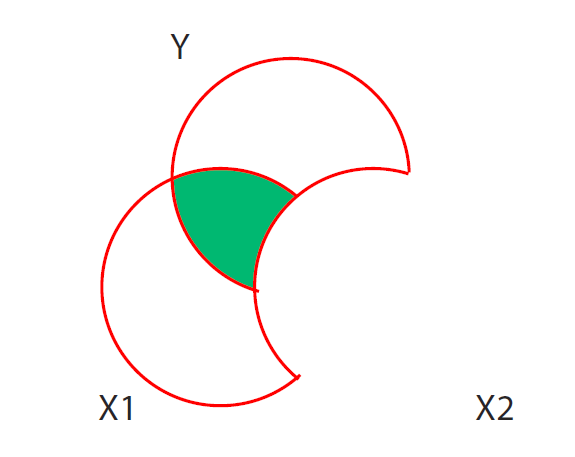
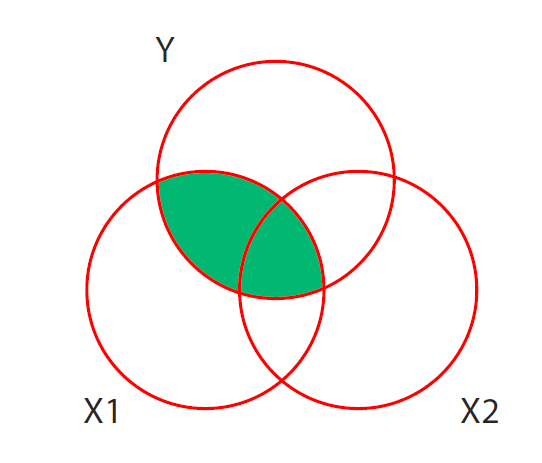

```{r setup, include=FALSE}
knitr::opts_chunk$set(echo = TRUE,
                      error = TRUE)
```


# Content Knowledge

1. Name and describe what each of the following figures are showing.





---

Delete this text and place your response here.

---


2. Briefly (1-2 sentences) describe the difference between partial and 
semi-partial correlations.

---

Delete this text and place your response here.

---

3. Briefly (3 sentences max) describe which type of correlation is generally
more useful, and why.

---

Delete this text and place your response here.

---


# Applied Practice

1. Use the code chunk below to import the "depression.xlsx" dataset

```{r diagnostic-practice, message = FALSE, warning = FALSE}
library(tidyverse)
library(rio)
library(here)
theme_set(theme_minimal())

d <- import(here(),
            setclass = "tbl_df") 
```

In the code chunk below, fit a model that addersses the following research 
questions.

> RQ1: What is the effect of income and physical health on depression, 
controlling for age and marital status?

In the data, `depression_score` indicates the overall depressive symptoms the
individual is exhibiting, with higher values indicating greater depression. 
Because health and marital status are categorical, they will need to have a 
reference group defined. Define these variables such that the reference group 
represents individuals who were married and in poor health. Note that after 
fitting the model you will still need to interpret the intercept relative to
**all** variables in the model

```{r model}
d <- d %>% 
  mutate()

m <- 
summary(m)
```

2. Calculate squared semi-partial correlations for the model in the code chunk
below.

```{r ssr}
library(lmSupport)

```

Interpret the squared semi-partial correlations below. 

---

Delete this text and place your response here.

---

3. Modify the code below to produce a coefficient plot

```{r coefplot}
library(broom)
tidy_pd <- tidy()

ggplot(tidy_pd, aes()) +
  
```

4. In a word document provide a table of the model, and a brief interpretation
of the findings. Write as if you were writing the results up for publication.
Include confidence intervals in your table and reference the squared semipartial
correlations in text.
